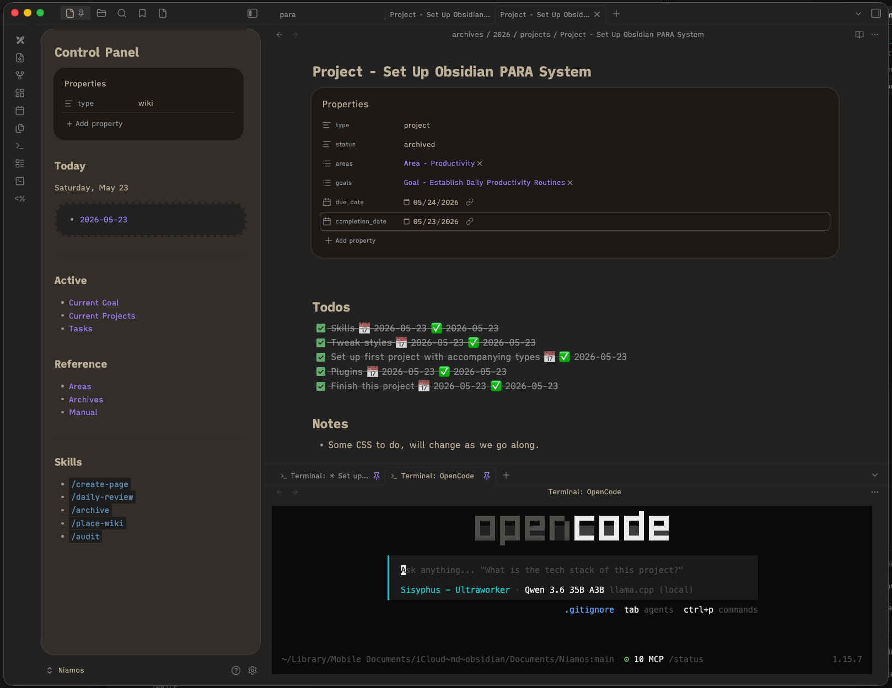

# Niamos

A personal Obsidian vault running a modified [PARA](https://fortelabs.com/blog/para/) method, plus the templates, queries, and Claude Code skills that make it work day-to-day.



Personal content (goals, projects, daily notes, etc.) is gitignored — what's tracked here is the **system**: the docs that describe how the vault is organized, the templates new pages are built from, the Dataview/Bases queries that power navigation, and the skills that automate the repetitive parts.

## What's in the repo

```
.claude/skills/   # Vault-local Claude Code skills (create-page, archive, audit, daily-review, place-wiki)
bases/            # .base files + Dataview/Tasks index pages
templates/        # Templater templates for each content type
wiki/system/      # Operating manual + navigation dashboards
  manual/         # Schema and workflow docs for each content type
  dashboards/     # Pinned pages: Control Panel, Current Projects, Tasks, etc.
CLAUDE.md         # Instructions Claude Code loads on every session
```

Everything else (`archives/`, `areas/`, `daily/`, `goals/`, `habits/`, `projects/`, and topical `wiki/` subfolders) is excluded by `.gitignore` — placeholder `.gitkeep` files preserve the folder structure.

## The content model

Six types, each with its own folder, frontmatter schema, and lifecycle. Full docs in `wiki/system/manual/`:

| Type | Role | Has status? |
|---|---|---|
| [Goal](wiki/system/manual/Goal.md) | Measurable outcome with an assessment loop | active / archived |
| [Area](wiki/system/manual/Area.md) | Permanent sphere of responsibility | — |
| [Project](wiki/system/manual/Project.md) | Finite deliverable with a due date | active / archived |
| [Habit](wiki/system/manual/Habit.md) | Recurring behavior becoming automatic | active / archived |
| [Wiki](wiki/system/manual/Wiki.md) | Durable topical reference | — |
| [Daily](wiki/system/manual/Daily.md) | Temporal record for one calendar day | — |

The [PARA Method](wiki/system/manual/PARA%20Method.md) page is the entry point — it covers how the six types relate, why this deviates from canonical PARA, and how the [Archives](wiki/system/manual/Archives.md) hybrid model (status flip + folder move) works.

## Skills

Five vault-local Claude Code skills in `.claude/skills/`, documented in [Skills.md](wiki/system/manual/Skills.md):

- **create-page** — interactive scaffolding for a Goal/Area/Project/Habit/Wiki
- **place-wiki** — picks the right `wiki/` subfolder, pushes back on root-dumping
- **archive** — atomic status flip + completion date + file move to `archives/<year>/<type>/`
- **daily-review** — morning carry-forward and evening highlights flow
- **audit** — vault-wide schema/drift validator

Skills delegate to the [Obsidian CLI](wiki/system/manual/Plugin%20Stack.md) for file ops so the metadata cache stays consistent. Multi-step destructive work (archive, audit) is bundled into Python scripts with rollback.

## Plugin stack

Documented in [Plugin Stack.md](wiki/system/manual/Plugin%20Stack.md). The load-bearing ones:

- **Templater** — applies type templates on file creation
- **Dataview** — `## Active Projects` / `## Active Goals` backlink queries on Area and Goal pages
- **Tasks** — task filtering with `useFilenameAsScheduledDate: true` scoped to `daily/`
- **Bases** — `.base` files for the cross-type indexes in `bases/`
- **Obsidian CLI** — the API the skills drive

## Reusing this for your own vault

The structure is opinionated but not personal. To adapt it:

1. Clone into a fresh directory
2. Open as an Obsidian vault, install the community plugins (see below)
3. Copy `wiki/system/dashboards/Control Panel (example).md` to `Control Panel.md` and pin it — the original is gitignored as personal
4. Read `wiki/system/manual/PARA Method.md` end-to-end
5. Start using the `create-page` skill in Claude Code to build out your own Goals/Areas/Projects

The skills assume Claude Code with the Obsidian Terminal plugin (or any shell rooted in the vault). `CLAUDE.md` at the repo root is what teaches Claude the conventions.

### Installing the plugins

Plugin vendored code (`main.js`, `styles.css`) is gitignored — only each plugin's `data.json` (config) and `manifest.json` (identity) are tracked. Install the plugins yourself; on first enable, Obsidian reads the tracked `data.json` and your settings restore automatically.

In Obsidian: **Settings → Community plugins → Browse**, install and enable each:

| Plugin | Role |
|---|---|
| Templater | Applies type templates on file creation (folder→template mappings live in tracked `data.json`) |
| Dataview | Backlink slices on Goal/Area pages, `## Today` block in dailies |
| Tasks | Checkbox tasks with date inference (`useFilenameAsScheduledDate: true` scoped to `daily/`) |
| Calendar | Sidebar daily-note navigation |
| Iconize (a.k.a. Icon Folder) | Folder/file icon customization |
| Excalidraw | Optional, drawing tool |
| Terminal | Embedded shell — Claude Code runs inside this |
| Pretty Properties | Frontmatter pills, banner/icon/cover rendering |
| Markdown Table Checkboxes | Interactive `- [ ]` inside markdown tables |

**Bases** is a core plugin in Obsidian 1.9+; enable under **Settings → Core plugins**.

**Hot Reload** (optional, dev-only) is gitignored entirely. Install via [BRAT](https://github.com/TfTHacker/obsidian42-brat) from `https://github.com/pjeby/hot-reload` only if you're authoring Obsidian plugins.
